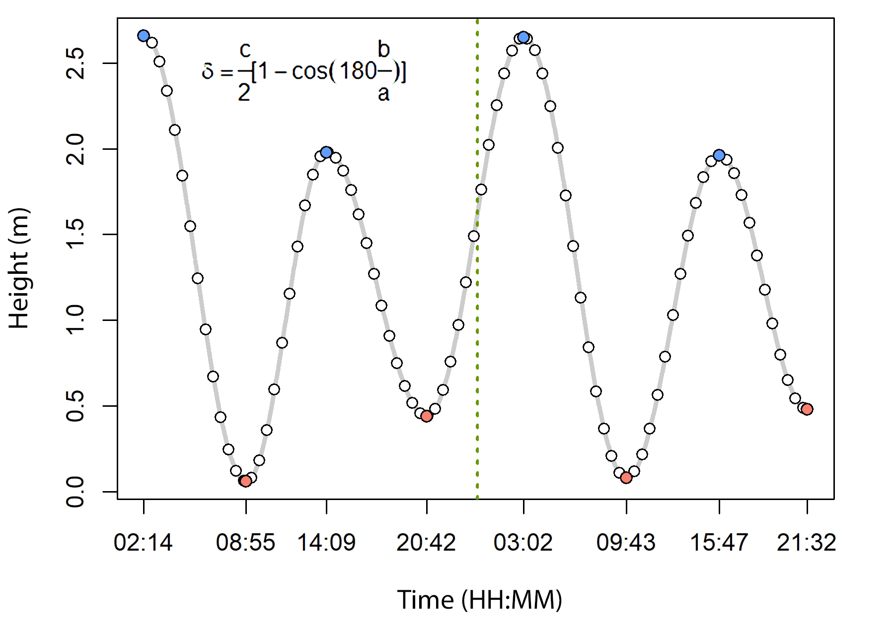

## Description

Example data and R code for tidal interpolation, developed as part of the manuscript *"Spatial networks reveal a highly centralized functional connectivity in non-breeding areas for a long-distance migratory shorebird"*. Currently under revision.

  

## Repository structure

This repository contains two main components:

- **R code** — Script to run the tidal interpolation function, which estimates tide heights at 1-minute intervals. The function implements the formula provided by the Servicio Hidrográfico y Oceanográfico de la Armada de Chile (SHOA) for tide prediction and interpolation.
- **Data** — Tide tables for the port of Ancud in January 2018, obtained from SHOA.

## Project status

Finalized.

## Organization

Developed as part of my PhD in the Bird Ecology Lab (BEL).

## Cite this code 
- If you use this code, please cite it as:  

Basso, E. (2026). Tide Interpolation Function. Zenodo. 

- Alternatively, the manuscript can be cited: 

Basso et al. (2026). *"Spatial networks reveal a highly centralized functional connectivity in non-breeding areas for a long-distance migratory shorebird"*. In review.

## License

This repository is licensed under the Creative Commons Attribution-NonCommercial 4.0 International License (CC BY-NC 4.0).  

© 2026 AccipiterBasso  
Full license: [https://creativecommons.org/licenses/by-nc/4.0/legalcode](https://creativecommons.org/licenses/by-nc/4.0/legalcode)
